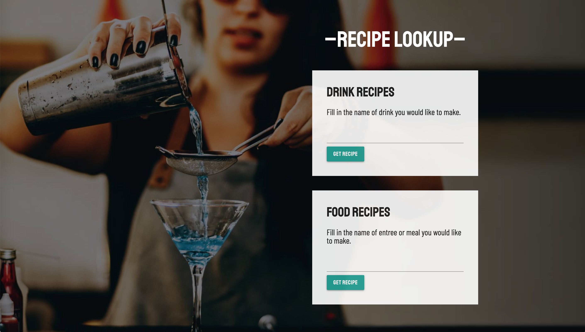

# Project 1: SKJ Recipe Library

## User Story

A collaborative effort to design a web application is based off of the user story below:

Our client, a restaurant owner asked us to build a food and beverage reference for thier wait and bar staff. Our goal was to create a mobile responsive web application that the staff can use to reference food and beverage recipes. This application is a quick and easy way for our client to search for and receive recipes "on the fly" while juggling their other duties as an employee serving at a restaurant.

View Website: https://jennifoo.github.io/project1/index.html
Github Repository: https://jennifoo.github.io/project1/

## Collaborative Roles
We built this application with a combination of HTML, CSS and JavaScript. Sean started the JavaScript for the main page, and Kyle wrote the code for the Results page. Jennifer designed the application with HTML, CSS and JavaScript for style and structure. 

## Solution
We provide a nimble, modular and easy to navigate design that features bold and rich images of staff workers preparing drinks and meals to speak to the target audience. On page refresh, the images cycle through a animation in less than 4 seconds. This creates a bold and minimalist vibe without sacrificing user experience with having to deal with long load times or being distracting by visual noise and excessive number of confusing effects. This style is not only represented through images, but also through all other element son the application such as colors, graphical elements and typeface selection.

For the user interface, we have modular elements that make it easy to press and enter in information on a mobile device and ensures that they can easily pull it up real quick and look up a recipe on the go. Additionally the black overlay at the end of the animation is not only for visual impact, but also to allow type to be legible on top of the images at any screen size. Our solution utilizes both design and technical aspects to work seamlessly to provide a good user experience.

Two database APIs were used in the development of the app called, "TheCocktailDB" and "TheMealDB". Some of the challenged of using this database was manipulating how the information was output into a way that was organized in a way that made sense for the user. We put together code that allowed a single function to feed in information from both databases and output the information in a user-friendly way on the results page.

## Future Development
Some ways we thought we could further improve our UI experience for future development is to bring the search functionality into the results page where the user could do the search again in the same interface which would elimiate an extra click by making the user go back to the homepage to do another search which would provide a more streamlined experience.

## Application Technical Requirements

* Must use at least two server-side APIs
* Must use a CSS framework _other than_ Bootstrap (Materialize was used for this application)
* Must be interactive (i.e: accept and respond to user input)
* Use at least one new third-party API
* Must have a polished UI
* Must meet good quality coding standards
* Does not use alerts, confirms or prompts (look into _modals_)
* Must be deployed to GitHub Pages

## Presentation Requirements

* Elevator pitch: a one minute description of your application
* Concept: What is your user story? What was your motivation for development?
* Process: What were the technologies used? How were tasks and roles broken down and assigned? What challenges did you encounter? What were your successes?
* Demo: Show your stuff!
* Directions for Future Development
* Links to the deployed application and the GitHub repository

## Grading Metrics 

| Metric        | Weight | 
| ---           | ---    |
| Concept       | 10%    |
| Design        | 20%    |
| Functionality | 30%    |
| Collaboration | 30%    |
| Presentation  | 10%    |

